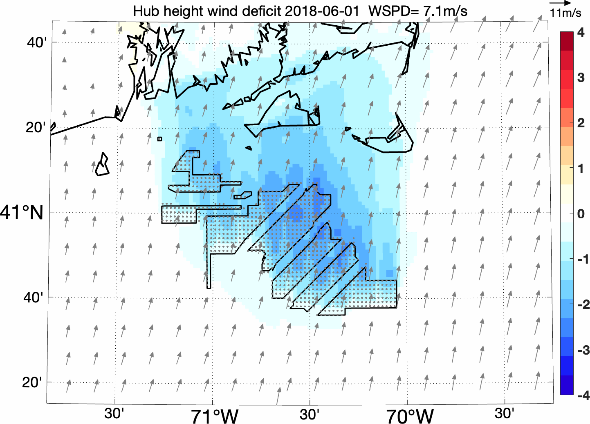

[Department of Energy (DOE) Wind Forecast Improvement Project III (WFIP-3)](https://www.google.com/search?client=safari&rls=en&q=Department+of+Energy+(DOE)+Wind+Forecast+Improvement+Project+III+(WFIP-3).&ie=UTF-8&oe=UTF-8&dlnr=1&sei=QGiHZ-HxAcGhur8P5Ois0A0). co-PI: H. Seo (UH/WHOI). Lead PI: Dr. [Anthony Kirincich](https://www2.whoi.edu/staff/akirincich/) (WHOI)
<!--more-->
---

This is a comprehensive observational and modeling study of the coupled atmospheric and oceanic boundary layers that will dramatically improve offshore windresource measurement and modeling science. Focusing on physical processes relevant to all U.S. offshore wind energy areas via observations of the Northeast U.S. outer continental shelf, this effort will increase our understanding of the coupled atmosphere-ocean system in wind energy areas as well as improve our ability to reliably predict boundary layer winds and properties critical for industry-specific resource assessment, load analyses, and design criteria. The Northeast shelf is home to five major offshore wind energy lease areas, including areas likely to be active and in construction during the field campaign, in addition to numerous ongoing scientific monitoring efforts. This study will combine the observational efforts of a diverse, experienced group of research and industry partners with an expert modeling team to improve wind resource forecasting abilities in an area with challenging offshore meteorological and oceanic conditions.

Objectives: Our goal is to drive down the cost of energy from offshore wind farms by improving wind resource assessments and forecast models and reducing the uncertainty in energy yield and design load assessments. Via high-quality observations of the marine atmospheric boundary layer (MABL) within and around the MA/RI lease areas, we will drive model improvements and create a benchmark standard for resource measurement and modeling science. Our modeling studies focus on improving wind resource assessment and forecasting of the MABL. We will develop and validate improved PBL and atmospheric surface layer schemes focusing on WRF-ARW, the core of NOAA’s High-Resolution Rapid Refresh (HRRR) system. Our advances will be informed by mesoscale (WRF) to microscale (WRF Large-Eddy Simulation: WRF-LES) coupled models for the analysis of MABL physical processes affecting rotor-plane winds and turbulence as well as wind plant wake clusters and upwind blockage that impact the wind resource. Testing of new schemes will focus on the range of conditions experienced by the Northeast shelf, including heterogeneity induced by sea-surface temperature gradients, coastal gradients, strong stability, and extreme events.

In parallel to these atmospheric model parameterization improvement efforts, our modeling system will incorporate ocean dynamics via a fully coupled atmospheric/wave/ocean modeling system, using WRF, WAVEWATCH III (WW3), and the Regional Ocean Modeling System (ROMS). This coupled system will provide detailed hindcast and forecast assessments, guide targeted sampling, and will be validated against comprehensive observational products. The coupled modeling system will use the Earth System Modeling Framework (ESMF version 8.0) and the National Unified Operational Prediction Capability (NUOPC) layer that underpin coupling within NCEP’s Unified Forecast System (UFS). WRF-ROMS coupling via NUOPC has already been tested by the project team in a suite of Mid-Atlantic Bight configurations that have evaluated approaches to specifying air-sea fluxes. By maintaining NUOPC compliance, the WRF and ROMS developments from this project will be immediately available to the fully coupled system, which the global user community can access through the ROMS Open Source portal. Through coordinated modeling and observation analysis we will develop better understanding of the physical processes that govern the structure and evolution of the MABL.

Detailed observations of the MABL’s vertical structure at key sites will be used to refine and validate planetary boundary layer (PBL) schemes, nested within a wide-area sampling of the MABL to create a multi-scale array of observations that will inform and guide modeling developments. Our observational efforts will leverage our team’s extensive measurement capabilities and our unique offshore research platform, the Air-Sea Interaction Tower (ASIT). We propose to conduct detailed sampling of MABL vertical structure at both the ASIT as well as a Large Barge anchored offshore in the center of the measurement array. Providing spatial context to these detailed observations, a series of land- and buoy-based surface and remote sensing assets (e.g., Sentinel moorings and lidar buoys) will sample the ocean and atmosphere to create a multi-scale observational array measuring wind and temperature profiles, surface meteorology, waves, currents, and turbulent fluxes. The ASIT, Barge, and all land-based sites will have power and space for large systems (e.g., scanning lidars or radars) from federal partners. High Frequency Radar (HFR)-based surface winds, satellite products, and our existing observational programs will add additional context.

Working directly with industry partners, we will develop applications that transition the model improvements into enhanced forecasting tools and uncertainty quantification in collaboration with grid and developer partners. Applications including improved lower order models, and improved understanding of how to use them, will be released publicly for the benefit of the industry, along with uncertainty quantification, validation, and design enhancement studies. Experimentation with the coupled model will enable us to develop ocean models, parameterizations, or data products of lesser complexity suited to industry applications. By incorporating our modeling developments into industry workflows, we will quantify the improvements to wind energy yield and design load calculations. These activities will be guided by a User Advisory Board composed of our partners, grid operators and wind plant developers with specific knowledge of industry concerns. All project data, model output, and model improvements will be widely disseminated via direct industry involvement, publications, and public data repositories.

Seo is a WHOI/UH co-PI and a part of a large team of academic institutions, national labs, and industries.
