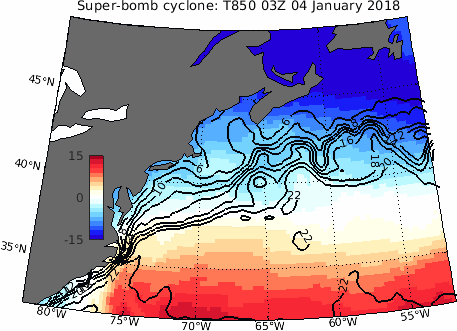

National Aeronautics and Space Administration (NASA) Modeling, Analysis, and Prediction (MAP) Program PI: H. Seo (WHOI/UH) and C.-A. Clayson (WHOI)
<!--more-->

---
This project will develop a better understanding of the physical processes governing the structure and evolution of the marine atmospheric boundary layer (MABL) in the Northeastern US and the New England shelf regions.

Capitalizing on the detailed in situ and remotely sensed observations of coupled boundary layer variables and air-sea fluxes uniquely available in the region, this project will validate and improve the MABL processes in the NASA’s Unified WRF (NU-WRF) modeling system to better represent and forecast extreme coastal storms. By including the full coupling of the regional ocean modeling system (ROMS) and the WaveWatchIII (WW3) to the NU-WRF to exploit the critical wave-ocean coupling effect on the atmosphere, the project will also enable, for the first time, NU-WRF-based coupled hindcast and forecast capabilities of extreme weather events with reduced uncertainty.

The project will undertake comprehensive modeling and validation efforts of the planetary boundary layer (PBL) schemes in the NU-WRF model under various MABL conditions, including extreme extratropical cyclones and stable boundary layers. The simulation of turbulent fluxes of momentum, heat, and moisture in the surface layer and their coupling with the PBL in the NU-WRF will be improved by correctly incorporating the Coupled Ocean-Atmosphere Response Experiment (COARE) bulk flux algorithm, and also directly incorporating ROMS and WW3 into the NU-WRF system. We will then carry out a series of case study simulations using this newly coupled NU-WRF model to quantify the impacts of the ocean/wave coupling on the NU-WRF simulation skills of extreme storms.

The project’s most significant outcome is to solidify the dynamical framework for enhancing our scientific understanding of air-sea coupling and PBL dynamics in high-resolution numerical models by demonstrating how a better understanding and representation of the MABL processes improves the fidelity and accuracy of weather and climate prediction models. The project will also provide new and improved NU-WRF hindcast/forecast capabilities over the ocean, with differing levels of representation of the ocean and waves coupling options. The improved COARE bulk flux algorithm will be coupled with a variety of available surface flux and PBL schemes within WRF, immediately benefiting the broad WRF modeling community.

This project is well-aligned with the long-standing goal of the NASA MAP Program to “understanding of the Earth as a complete, dynamic system.” It is also relevant to the specific research theme included in the 2020 MAP solicitation on “Coupling in the Earth System” as the project will advance our understanding and increase our capacity to represent the coupling across the air-sea boundary layer in weather and climate model by using a unique set of in situ MABL measurements. Further, our investigation of air-sea interaction and model skills in the NU-WRF under high-impact weather events is relevant to the research theme on “Extremes in the Earth System”. The work is highly relevant to science related to incubation observing-system priorities in the 2017 NASA Decadal Survey related to the PBL.
