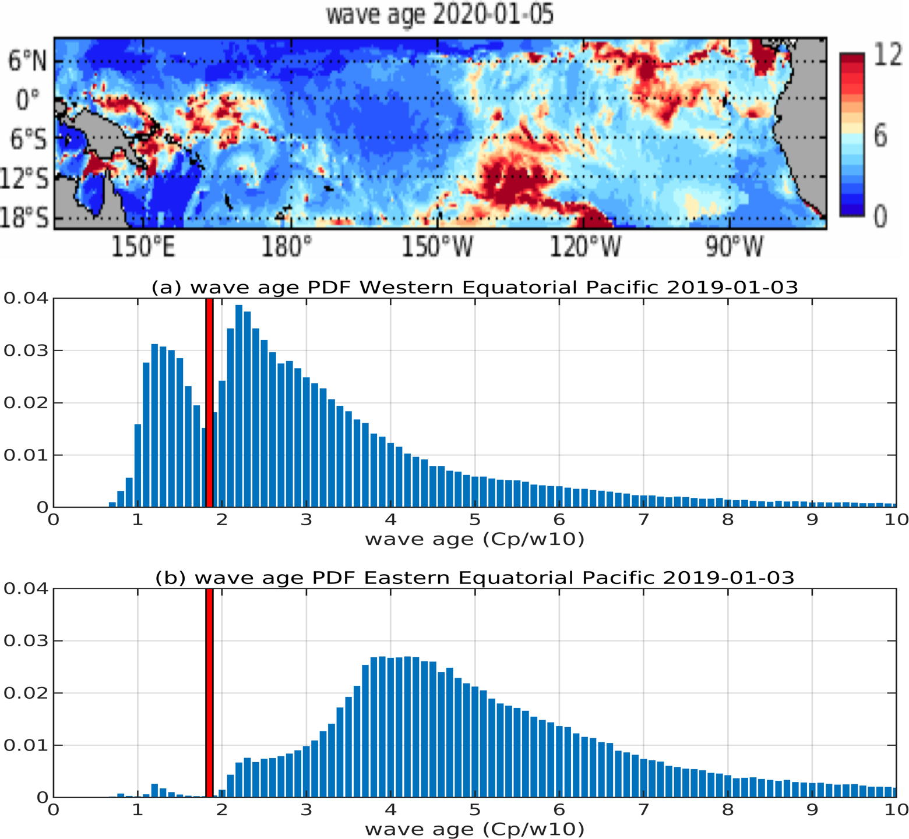

National Oceanic and Atmospheric Administration (NOAA) CVP Tropical Pacific Observing System (TPOS) Pre-field Modeling (Seo, PI)

---

The goal of the TPOS2020 project is to design an efficient and effective backbone observing system to better understand the processes in the tropical Pacific that are instrumental to the El Niño-Southern Oscillation (ENSO) and provide useful observational constraints for predictions. The process studies being planned in the western and eastern equatorial Pacific are intended to shed light on physical processes and guide the design and development of the TPOS.
<!--more-->
---

The strong sea surface salinity and temperature fronts marking the eastern edge of the warm pool and equatorial cold tongue represent dramatic regime transitions from the ocean-atmosphere-wave coupling perspective, where short space/time scale changes in the balance between the oceanic and atmospheric boundary layers present significant observational and modeling challenges. As recognized by the TPOS2020, the current tropical Pacific observing system is insufficient to characterize the transient and fine-scale nature of the ocean-atmosphere-wave interactions. This hampers our ability to understand the impacts on local and non-local large-scale drivers, such as Madden-Julian Oscillation (MJO) and ENSO. Most simulation and operational models exhibit difficulty simulating these processes due to inadequate spatial resolution and physical parameterizations. The biases in observations and models, in turn, impede developing and testing robust coupled data assimilation schemes for numerical weather prediction and extended-range prediction systems on subseasonal-to-seasonal and seasonal time-scales.

We propose a pre-field modeling study to improve our process understanding and representation of air-sea flux and associated turbulent exchanges and dissipation in the oceanic and atmospheric boundary layers across the multiple TPOS regimes and to determine their dependence on varying ocean eddy and fronts, diurnal cycle, barrier layer, and surface wave conditions. A crucial element is to exploit extensive high-resolution, ocean-atmosphere-wave coupled model simulations, validated with existing in situ and satellite observations in the TPOS, to determine the simulation sensitivity to assumptions in the parameterized air-sea interaction and choices of model physics and resolution.

Our combined model simulations and data analyses aim to provide specific and helpful information to the design of the process study and the TPOS observing system while also contributing to refinements of existing air-sea flux and turbulent mixing schemes to improve simulation and prediction models. Better resolved and represented air-sea interaction in the model will then be used to quantify the impacts on simulation skills of large-scale climate drivers such as MJO and ENSO.

The project directly contributes to the most relevant priority areas of TPOS Process Studies and TPOS2020, and the NOAA's broad mission of improved environmental prediction by enhancing the predictability of the evolution of the Pacific climate system on seasonal to interannual time-scales. First, the project will examine the roles of surface waves, stratification and mixing, and eddies and fronts, the primary observational foci of the TPOS process studies. The refined model and improved process understanding will guide the design of a distributed array of in situ observations to improve space-time sampling. Secondly, it is of primary interest to TPOS to determine whether and how the improved representation of air-sea interaction improves the simulations of the critical large-scale variability such as MJO and ENSO. The enhanced mechanistic understanding of the upscaling effect will aid the improved extended-range and seasonal to multi-year predictions.

