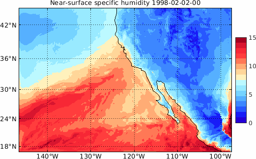

National Science Foundation (NSF) Physical Oceanography & Climate and Large-scale Dynamics, PI: Hyodae Seo (WHOI/UH), A. Miller (Scripps)
<!--more-->

The coastal climate of California is profoundly affected by the ocean, which moderates its hot summers and provides moisture for much-needed winter rains. While the importance and impact of the mean state of the ocean are well appreciated, the impact of the anomalous state of the ocean on coastal climate is far less well understood. 

Sea surface temperature (SST) and ocean surface current anomalies, ranging from the meso-to-frontal scales of cool coastal upwelling to the regional-to-basin scales of the marine heat waves of the “Blobs”, are inherently coupled with the atmosphere. The fundamental coupled ocean-atmosphere feedback processes that affect the climate, weather, and upwelling along the coast are the focus of this study. In addition, we will explore how the anomalous ocean-atmosphere coupling could affect the region’s climate under projected greenhouse-gas-forced changes in major large-scale drivers, such as the expansion of the Hadley Cell and repositioning of the North Pacific High Pressure system, and increases in ocean stratification. To quantify the effects of ocean-atmosphere boundary layer coupling on California coastal regions, we will conduct a series of regional high-resolution coupled ocean-atmosphere model simulations, including full ocean-atmosphere coupling and well-resolved orography and land-sea distribution. These will include ensembles of 10-year long runs forced by observed current climate and projected future climate boundary conditions, as well as ensembles of runs initialized under observed marine heat wave conditions. We will use these runs to study how the statistics of daily, intraseasonal and interannual variability in the atmosphere and the oceanic upwelling field, are affected by the anomalous ocean-atmosphere conditions associated with eddies, fronts, and extreme SST anomalies, and assess how they may be altered by changes in large-scale atmospheric and oceanic drivers associated with global warming.

Clarifying the processes that control observed and future changes in coastal climate supports the intensive community research effort directed towards improved understanding of climate change at the regional-to-local scale. Our extensive physical diagnostics of model simulations and observational comparisons will also elucidate the coupled physical processes accounting for long-term changes in coastal upwelling that are affected by mesoscale ocean-atmosphere feedbacks and projected changes in large-scale drivers. Determining the dynamic and thermodynamic controls of the multiple forcing drivers can also help to improve the basic state of global coarse-resolution climate simulations, which typically suffer from strong biases in eastern boundary upwelling systems. The results may also lead to improved short-term climate predictions by better resolving the influence of anomalous ocean states and ocean-atmosphere interactions in dynamical forecasting frameworks. In summary, we address a vital range of scales and processes that are not adequately resolved by current climate datasets and global climate models in order to improve our overall understanding of regional coastal climate variability, sensitivity, and predictability.
